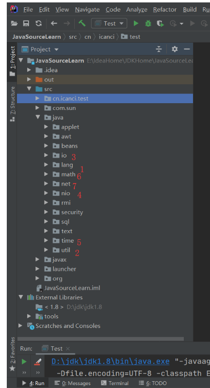

查看源码的通用顺序:

具体的内容简介如下：

**1、`java.lang`**

这里面其实就是Java的基本语法，比如各种基本包装类型（`Integer`、`Long`、`Double`等）、基本类（`Object`，`Class`，`Enum`，`Exception`，`Thread`）等等...

**2、`java.lang.annotation`**

包含Java注解基本元素相关的源码

**3、`java.lang.reflect`**

包含Java反射基本元素相关的代码

**4、`java.util`**

这里面放的都是Java的基本工具，最典型和常用的就是各种容器和集合（`List`、`Map`、`Set`）

**5、`java.util.concurrent`**

大名鼎鼎的JUC包，里面包含了Java并发和多线程编程相关的代码

**6、`java.util.function` +`java.util.stream`**

包含Java函数式编程的常见接口和代码

**7、`java.io`**

包含Java传统I/O相关的源码，主要是面向字节和流的I/O

**8、`java.nio`**

包含Java非阻塞I/O相关的源码，主要是面向缓冲、通道以及选择器的I/O

**9、`java.time`**

包含Java新日期和期间相关的代码，最典型的当属`LocalDateTime`、`DateTimeFormatter`等

**10、`java.math`**

主要包含一些高精度运算的支持数据类

**11、`java.math`**

主要包含一些高精度运算的支持数据类

**12、`java.net`**

主要包含Java网络通信（典型的如：`Socket`通信）相关的源代码。
